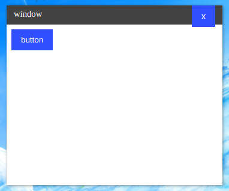

# nwui

[](https://gitter.im/go-nwui/nwui?utm_source=badge&utm_medium=badge&utm_campaign=pr-badge&utm_content=badge)
[](https://gowalker.org/github.com/go-nwui/nwui)
[](http://godoc.org/github.com/go-nwui/nwui)

node-webkit UI for Go

## Screenshot



## nwui控件编写指南

### 基础接口

控件struct内必须有一个`ID`字段

以及有一个

```go
Init(sender chan EventMsg) (string, Control, map[string]func(v string))
```

和一个

```go
GetID() string
```

方法。

`Init`方法接收一个`sender`用于发送消息给前端，chan的内容为`EventMsg`

```go
type EventMsg struct {
	ID    string `json:"id"`    // 控件的ID
	Event string `json:"event"` // 事件名称
	Value string `json:"value"` // 想发送信息的内容，复杂内容推荐用json编码
}
```

返回值为控件的html + 控件的定义 + 控件的事件列表

控件的定义struct如下：

```go
type Control struct {
	Name       string // 控件名称，不能和其他控件重复
	CSS        string // 控件的css
	JavaScript string // 控件的js
}
```

控件的事件列表为`map[string]func(v string)`

map的key需要设置为事件名称，比如：

```go
events["ButtonOnClick"] = func(v string) {
	b.OnClick()
}
```

当事件触发时，value里的函数会被调用并传入前端发来的数据（如果数据为空那么可以忽略）

`GetID`方法返回这个控件的`ID`（因为反射指针的限制所以只能多加这么一个方法才能获取ID）

### 控件初始化

可以参考`Button`控件

```go
// 控件结构体
type Button struct {
	ID      string
	Text    string
	OnClick func()
	sender  chan EventMsg
}

// 控件的初始化方法
func (b *Button) Init(sender chan EventMsg) (string, Control, map[string]func(v string)) {
	if b.ID == "" {
		b.ID = NewControlID()
	}
	events := make(map[string]func(v string))
	b.sender = sender

    // 控件的css和js
	con := Control{
		Name: "Button",
		CSS: `
.button {
    border: 4px solid #304ffe;
    color: white;
    background: #304ffe;
    padding: 6px 12px;
}
.button:hover {
    background: white;
    color: #304ffe;
}
.button:active {
    color: #fff;
    background: #304ffe;
    box-shadow: 1px 2px 7px rgba(0, 0, 0, 0.3) inset;
}`,
		JavaScript: `
function ButtonSetText(id,text) {
	var button = document.getElementById(id);
	button.textContent = text;
}
(function() {
	var buttons = document.getElementsByClassName('button');
	for (var i = 0; i < buttons.length; i++) {
		var button = buttons[i]
		button.onclick = function(){
			send(button.id, "ButtonOnClick", "");
		};
	}
})();`,
	}
	html := "<button id=\"" + b.ID + "\"class=\"button\">" + b.Text + "</button>"
	if b.OnClick != nil {
		// 如果用户使用了OnClick事件
		// 那么添加事件
		events["ButtonOnClick"] = func(v string) {
			b.OnClick()
		}
	}
	return html, con, events
}
```

上面的js里的`ButtonSetText`函数是在触发这个事件时会自动调用的，并且会传入目标控件的ID和后端传来的数据

触发的后端函数长这样：

```go
// 设置按钮文字
func (b *Button) SetText(text string) {
	// 这里的判断是防止控件还没有初始化
	// sender还未赋值用户就调用
	if b.sender != nil {
		// ButtonSetText 为需要调用的js函数
		b.sender <- EventMsg{b.ID, "ButtonSetText", text}
	}
	b.Text = text
}
```

当按钮被点击时会

```javascript
send(button.id, "ButtonOnClick", "");
```

`send`是一个用于给后端发送消息的函数

定义为

```javascript
send(id, event, value)
```

`ButtonOnClick`为事件名称

后端会自动调用与`ButtonOnClick`事件绑定的函数，并传入`value`